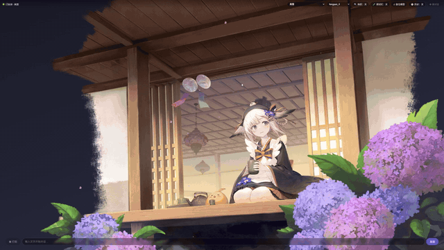

# Local-LLM-Voice-Avatar

完全离线运行的本地语音 AI 伴侣：LLM 对话 × 语音识别与合成 × Live2D 动态形象，数据不出本机。

<p align="center"></p>

## 核心特性

- **完全离线**：默认配置（Ollama + 本地语音模型）零云依赖，断网可用，隐私数据不出本机。
- **引擎可插拔**：5 类 LLM（其中 llama_cpp_llm 需自行安装 llama-cpp-python 且本项目未经实测）、7 种语音识别、16 种语音合成引擎，改一个配置字段即可切换，任意组合。
- **Ollama 原生接入**：走 Ollama 原生 `/api/chat` 接口，显式支持 `num_gpu` / `num_ctx` / 思考模式 / 模型预热。
- **自研极简前端**：轻量 Live2D 舞台，带触摸/手势交互引擎，可自定义模型与互动热区——Azur Lane 类 touch.json 模型解锁全部触摸特性，mao_pro 等无规则数据模型走启发式兜底。
- **GUI 启动器**：一键启动全套服务，内置「声音模型体系」——声音卡管理与 GPT-SoVITS 权重热切换。
- **开箱即用的形象**：内置 Live2D 官方示例模型 mao_pro，克隆后即可对话。

## 快速开始（约 15 分钟，零外部资产）

不装 GPT-SoVITS 也能获得完整的「语音对话 + Live2D 形象」体验。前置要求：Python 3.10–3.12、[uv](https://docs.astral.sh/uv/)、Node.js（含 npm）、[Ollama](https://ollama.com/)。

```bash
git clone <本仓库地址>
cd Local-LLM-Voice-Avatar
uv sync
cd frontend-minimal && npm install && npm run build && cd ..
cp config_templates/conf.ZH.default.yaml conf.yaml   # Windows PowerShell 用 copy 命令
```

然后：

1. 拉一个 Ollama 模型（配置默认已指向 Ollama）：`ollama pull qwen2.5:latest`（约 4.7GB，弱网耗时较长）。
   想用其他模型，改 `conf.yaml` 中 `agent_config.llm_configs.ollama_llm.model` 即可。
2. 启动：

```bash
uv run run_server.py
```

浏览器打开 `http://127.0.0.1:12393` 即可对话。首次启动会自动下载语音识别模型（SenseVoice，约 1GB，源为 GitHub Releases），下载完成前语音对话不可用，之后完全离线运行。弱网环境可先手动获取模型放入 `models/sherpa-onnx-sense-voice-zh-en-ja-ko-yue-2024-07-17/`（目录或同名压缩包已存在即跳过自动下载；镜像渠道如 hf-mirror.com）。

## 进阶配置

### 更自然的离线语音合成（sherpa-onnx TTS）

pyttsx3 音质有限。sherpa-onnx 提供明显更自然的离线中文合成：按 `conf.yaml` 中
`sherpa_onnx_tts` 配置块的注释下载对应模型（如 vits-melo-tts-zh_en），填入路径后把
`tts_model` 改为 `'sherpa_onnx_tts'`。

### GPT-SoVITS 完整层（自定义音色）

用自己准备的 5–10 秒参考音频（或微调权重）合成个性化音色：

1. 安装 [GPT-SoVITS](https://github.com/RVC-Boss/GPT-SoVITS) 整合包（本项目适配器基于
   v2pro-20250604 布局自制），自备权重与参考音频。
2. 在 GUI 启动器「TTS 页」选择 GPT-SoVITS 根目录——「一键启动」会直接用所选声音模型
   权重拉起 API（无需拷贝任何脚本进整合包）；无 GUI 时用
   `python scripts/gpt_sovits/start_gsv_api.py --root <GSV根目录>` 启动。
3. 在「声音模型体系」中新建声音模型，按提示选择参考音频——声音卡会自动生成；把
   `tts_model` 改为 `'gpt_sovits_tts'`，按声音卡中的信息填写 `gpt_sovits_tts` 配置块。

### 声音卡约定

- `voices/<声音名>/` 下放 `ref.wav`（参考音频）与 `voice.json`（声音卡信息），由 GUI 启动器
  的「新建声音模型」对话框自动生成；参考音频与 GPT-SoVITS 权重由用户自备，本仓库不内置真人音色。
- `ref_audio_path` 是 GPT-SoVITS 进程读取的路径，请确保该进程能访问到该文件。

## Roadmap

已完成：

- [x] Ollama 原生 `/api/chat` 接入（显式 GPU 层数 / 上下文 / 思考模式 / 模型预热）
- [x] 自研极简前端与 Live2D 触摸/手势交互引擎
- [x] GUI 启动器与声音模型体系（声音卡、权重热切换）

计划中：

- [ ] Piper TTS（离线低资源语音合成）
- [ ] 语音合成引擎体系持续演进

## 基于上游的声明

本项目基于 [Open-LLM-VTuber](https://github.com/Open-LLM-VTuber/Open-LLM-VTuber) v1.2.1 二次开发而来，
感谢上游项目的优秀工作。本仓库版本号自 1.0.0 起独立演进，与上游版本号无关。
上游文档见 [open-llm-vtuber.github.io](https://open-llm-vtuber.github.io/)（源仓库
[open-llm-vtuber.github.io](https://github.com/Open-LLM-VTuber/open-llm-vtuber.github.io)）。

## 相对上游的改动总览

自 v1.2.1 切分以来的主要差异浓缩为 10 项（细节见 docs/context/ 各模块文档与提交历史）：

| # | 改动 | 说明 |
|---|------|------|
| 1 | 自研极简前端 | 从零重写的唯一前端（入口 `/m/`）：轻量 Live2D 舞台、WS 协议子集、音频队列、聊天历史与口型同步；上游官方前端整体退役 |
| 2 | Live2D 触摸规则引擎 | Azur Lane 类 `touch.json` 规则驱动交互：热区、动作链、冷却与条件门槛 |
| 3 | 手势+参数驱动引擎 | 拖拽步进链、目光跟随、参数写入与一键复位；无规则数据的模型走启发式兜底 |
| 4 | Live2D 调试栏与热区叠加层 | 前端内置可视化调试：热区/参数/动作实时查看 |
| 5 | Spine 渲染支持 | 极简前端同时支持 Spine 模型（上游 Cubism 专属前端无法加载） |
| 6 | 前端模型切换与 allowlist | 同角色多 Live2D 模型切换，白名单控制可选集 |
| 7 | Ollama 原生接入 | `ollama_native_llm` 走原生 `/api/chat`：显式 `num_gpu` / `num_ctx`、思考模式、模型预热 |
| 8 | GUI 启动器 | PySide6 一键启动全套服务，环境自检与缺失提示 |
| 9 | 声音模型体系 | 声音卡管理、参考音频与 GPT-SoVITS 权重热切换（GUI 内置） |
| 10 | 模型维护脚本链 | Live2D 扫描/标定/修复 4 件 + GPT-SoVITS API 启动适配器（`scripts/`） |

> 运行测试：`uv run --extra test python -m pytest -q`。新克隆内预期约 190 passed + 10 skipped——跳过项为公开克隆守卫按设计生效（关联本机私有数据的用例），非缺用例。

## Live2D 素材授权声明

内置的 Live2D 示例模型 mao_pro（Mao Niziiro）来自 Live2D 官方示例素材，**不受本项目的 MIT
许可证约束**，按 Live2D Cubism 免费素材许可协议授权。该协议对素材的使用范围有限制（含商业
使用限制），使用或再分发前请阅读 [LICENSE-Live2D.md](LICENSE-Live2D.md) 原文。

## License

本项目代码以 MIT 许可证发布（见 [LICENSE](LICENSE)）：上游版权（© 2025 Yi-Ting Chiu）保留，
本仓库的修改部分版权归 © 2026 yancheng1018 所有。Live2D 示例模型按上述单独条款授权。
